## KakaoBrain에서 개발한 Pororo 환경설정 및 예제코드 ##

## 한계점 ##
- 현재 KakaoBrain의 Pororo는 torch=1.6(cuda 10.1)에서 동작
- cuda 10.1을 지원하는 Gpu에서만 동작가능
- 현재 지원가능한 Gpu 아래 링크에서 확인
[지원가능한 GPU확인](https://www.wikiwand.com/en/CUDA)
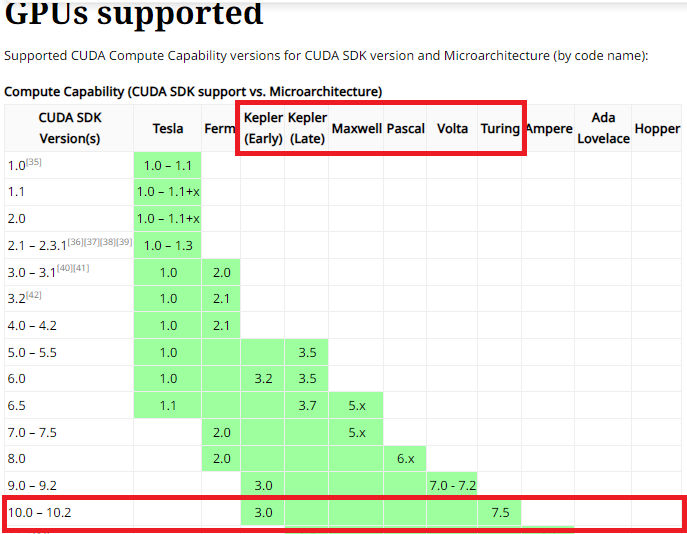

### WSL 및 Ubuntu 설치 ###
1. 윈도우 업데이트 진행
- WSL 설치 이전 모든 윈도우 업데이트 진행 수행
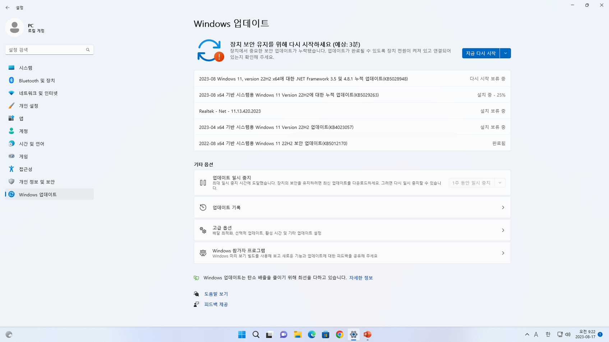

2. 윈도우 터미널 설치
- WSL 설치 이전 사용할 윈도우 터미널 설치
- Microsoft Store에서 Windows Terminal 검색후 다운로드
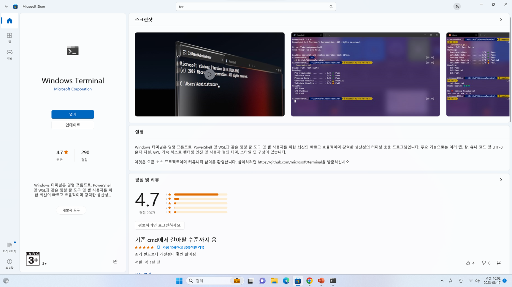

3. 윈도우 추가 기능 활성화
- 윈도우 검색창에 'windows 기능 켜기/끄기' 검색
- 'Linux용 windows 하위 시스템' 기능 활성화
- '가상 머신 플랫폼' 기능 활성화

4. WSL 설치
- 윈도우 검색창에 'windows powershell'검색
- 'wsl --install' 명령어 입력


5. Linux용 Windows 하위 시스템 활성화
- 아래 명령어 입력
- dism.exe /online /enable-feature /featurename:Microsoft-Windows-Subsystem-Linux /all /norestart
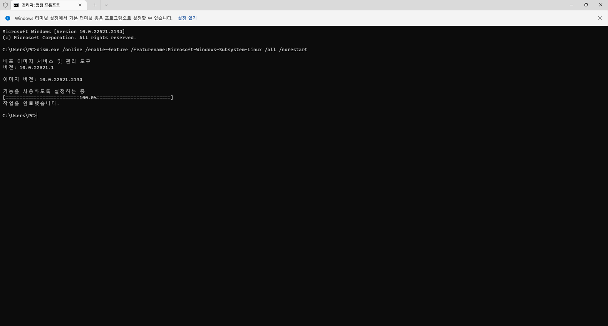

6. 가상머신 플랫폼 활성화
- 아래 명령어 입력
- dism.exe /online /enable-feature /featurename:VirtualMachinePlatform /all /norestart
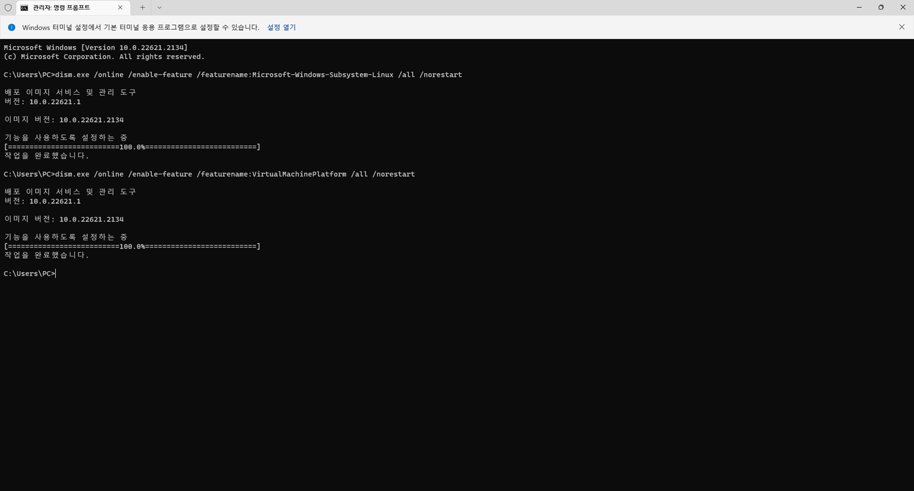

7. WSL2를 기본 버전으로 설정
- 아래 명령어 입력
- wsl --set-default-version 2
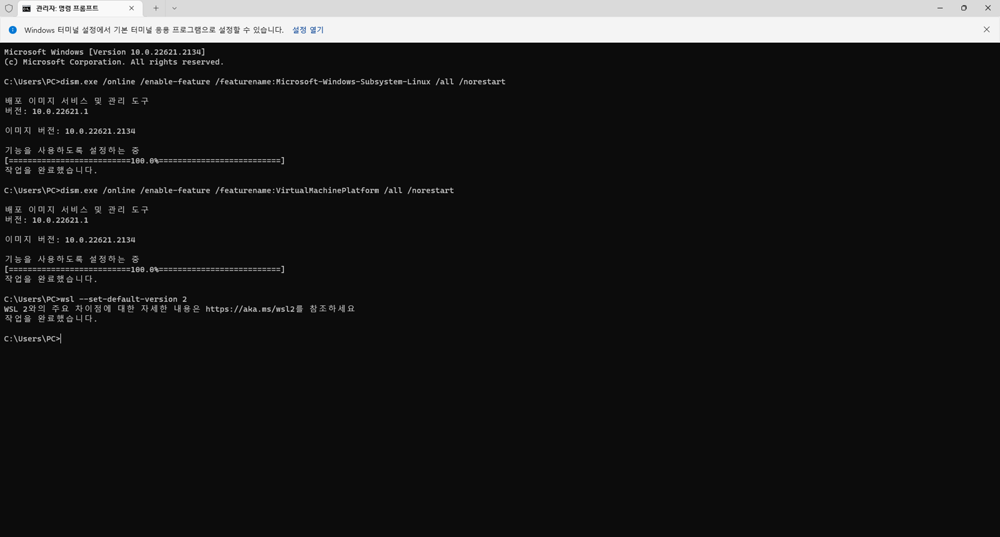

8. Linux 커널 업데이트 패키지 다운로드 및 설치
- 아래 파일 다운로드 후 설치
- [다운로드링크](https://wslstorestorage.blob.core.windows.net/wslblob/wsl_update_x64.msi)
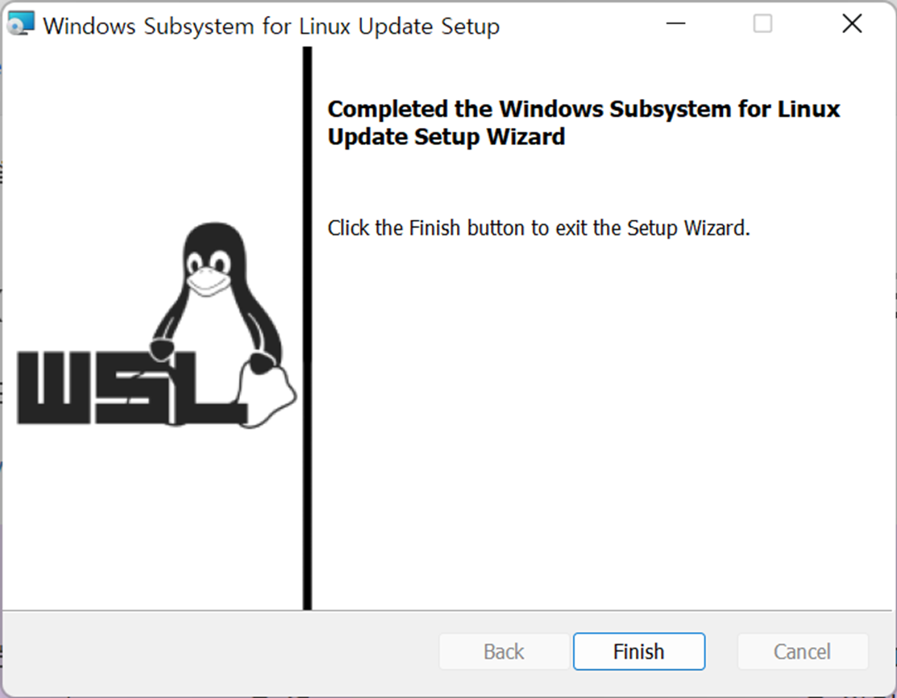

9. 설치가능한 Linux 버전 확인
- 아래 명령어 입력
- wsl -l -o
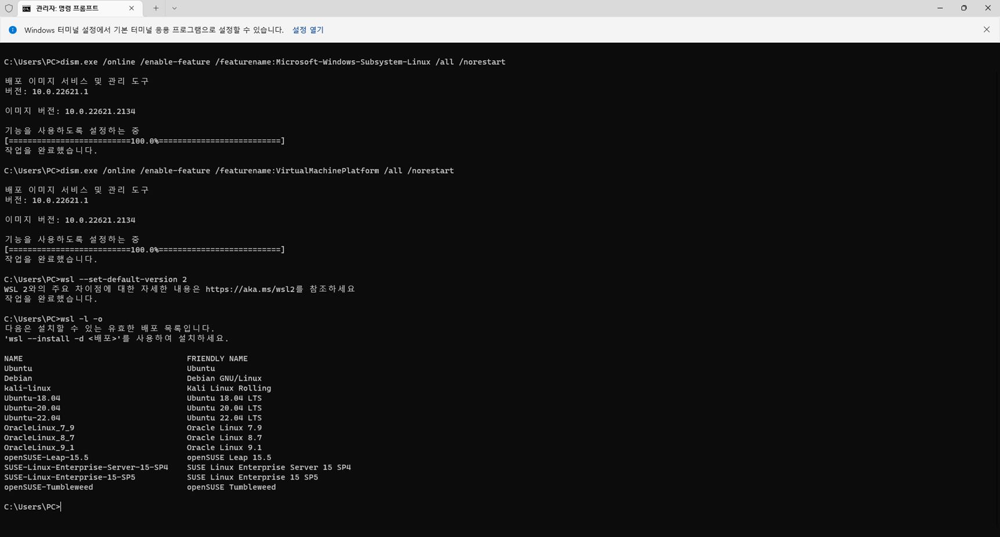

10. Ubuntu 20.04 LTS 버전 설치
- 아래 명령어 입력
- wsl --install –d ubuntu-20.04
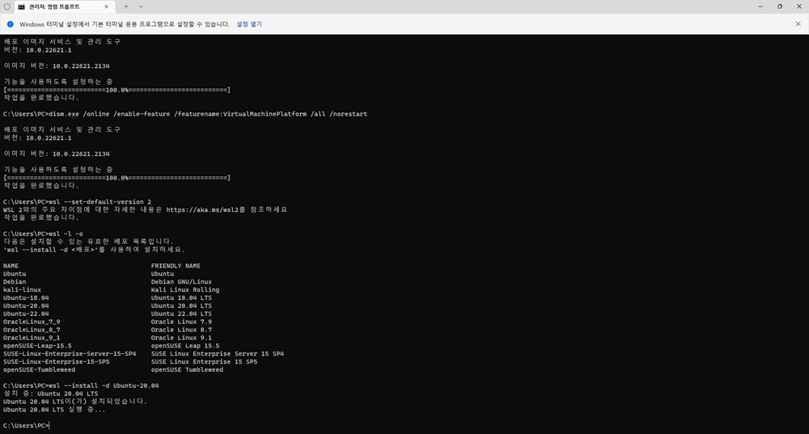
- 개인 계정 설정
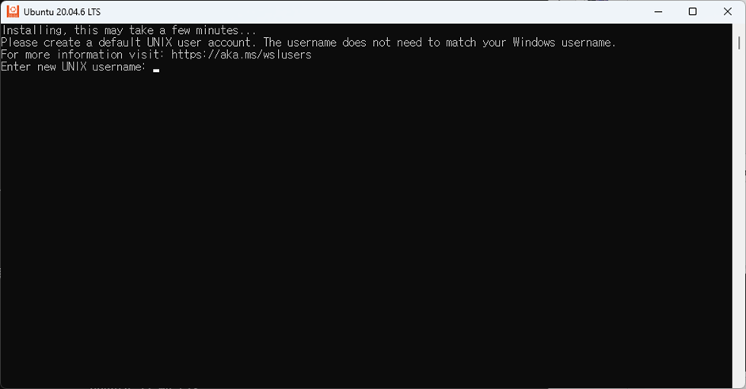

11. Anaconda 설치 및 환경변수 설정
- Anaconda 설치
- wget https://repo.anaconda.com/archive/Anaconda3-2023.07-2-Linux-x86_64.sh chomod +x Anaconda3-2023.07-2-Linux-x86_64.sh ./Anaconda3-2023.07-2-Linux-x86_64.sh
- 환경변수 설정 아나콘다 경로는 개인별로 다를 수 있음에 유의
- vi 편집기에서 경로 입력후 저장
- vi ~/.bashrc
- export PATH="/home/사용자이름/anaconda/bin:$PATH"
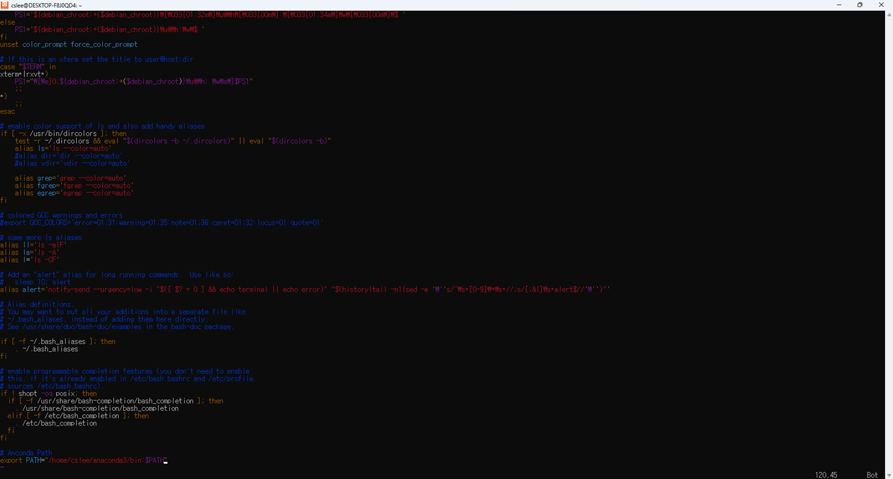

12. Anconda 가상환경, 주피터노트북 연결
- 가상환경 생성 및 확인
- conda create -n 환경이름 python=3.7.16
- conda env list
- conda activate 환경이름

- 주피터 노트북 설치 및 커널 연결
- pip install jupyter notebook
- pip install ipykernel
- python -m ipykernel install --user --name 환경이름 -- display-name 표시커널이름
- jupyter notebook


13. Pytorch 및 cuda 설치
- conda install pytorch==1.6.0 torchvision==0.7.0 cudatoolkit=10.1 -c pytorch


14. Pororo 설치
- git clone https://github.com/kakaobrain/pororo.git
- cd pororo
- pip install -e .

15. Pororo 테스트
```python
from pororo import Pororo
Pororo.availabel_tastk()
# output
# "Available tasks are ['mrc', 'rc', 'qa', 'question_answering' ... 중략"
```